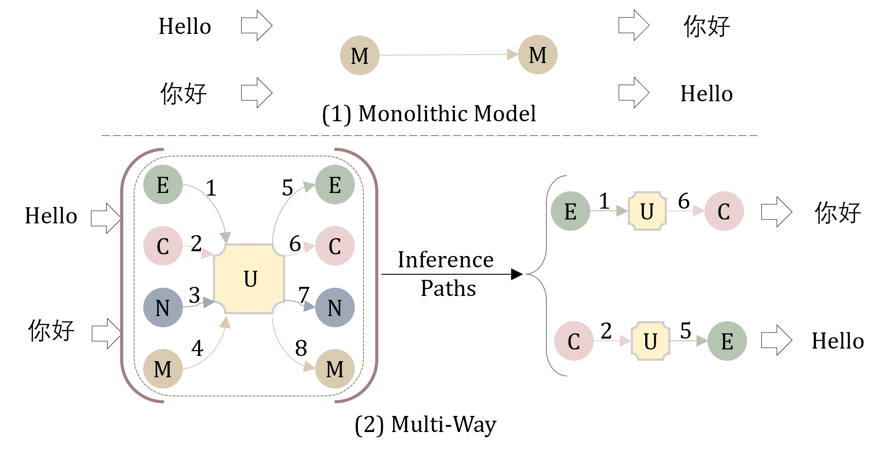
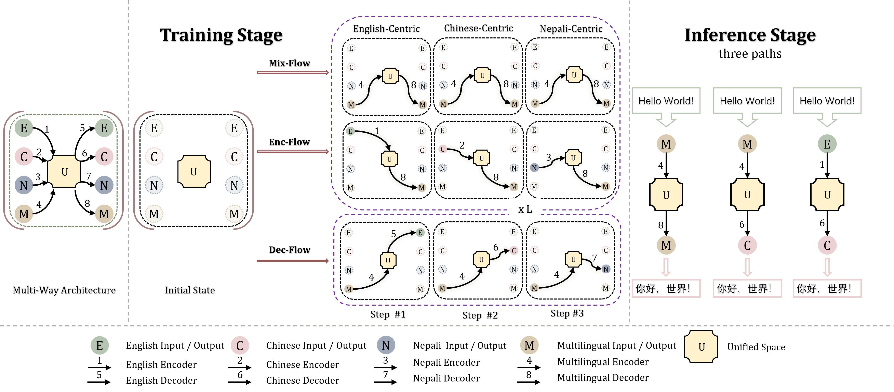

<div align="center">

</div>

------

<p align="center">
  <a href="#overview">Overview</a> •
  <a href="#installation">Installation</a> •
  <a href="https://arxiv.org/pdf/2212.10551.pdf">Paper</a> •
  <a href="#citation">Citation</a> 
</p>


## Overview

Lego-MT is a new solution for massively multilingual machine translation that uses detachable models with multiple branches. 
<div align="center">

</div>

**Training Stage:** Only  language-specific parameters are loaded into GPU memory. The training maintains three flows: Enc-Flow for training specific encoder, Dec-Flow  to train language-specific decoder, and Mix-Flow to avoid the overfitting of the multilingual encoder and decoder to each language-centric training data. The whole training procedure of Lego-MT takes a two-stage design.  In the first stage, we initialize each module of  the Lego-MT model with a pre-trained MT model. After initialization,  we shuffle a one-to-many dataset to obtain a new training sequence for Enc-Flow training. In the second stage, we fix the encoder parameter of Mix-Flow and learn the Dec-Flow decoder.

**Inference Stage:** Users can decide to load which flow for inference.

<div align="center">

</div>


## Installation
Note: Lego-MT requires Python 3.6+.

**Using Pip**
```
pip install -r ./requirements.txt
```


**Installation for local development:**
```
git clone https://github.com/CONE-MT/Lego-MT.git
cd Lego-MT
pip install -e .
```

## What News
You can download the dataset of Lego-MT from [here](https://pan.baidu.com/s/1L3gFonSGzCB7sVfvLAQcuA)(password: 5q6u).


## Quick Start
Following those steps to show you how to inference with Lego-MT.

#### Step 1: Download Model
You can download the checkpoint of [Lego-MT](https://drive.google.com/drive/folders/1hSSTI-Tg1KXA4lgYr1FMnD6H7LixUvgw?usp=sharing).


#### Step 2: Prepare Your Data
```python
  python ./code/fairseq/scripts/spm_encode.py \
      --model /path/spm.128k.model \
      --output_format=piece \
      --inputs=/path/src_input \
      --outputs=/path/spm.src

  python ./code/fairseq/scripts/spm_encode.py \
    --model /path/spm.128k.model \
    --output_format=piece \
    --inputs=/path/tgt_input \
    --outputs=/path/spm.trg

  python ./code/fairseq/fairseq_cli/preprocess.py \
      --source-lang src --target-lang trg \
      --testpref /path/spm \
      --workers 50 \
      --thresholdsrc 0 --thresholdtgt 0 \
      --destdir /path/IDX_PATH \
      --srcdict data_dict.rm.alllans.txt --tgtdict data_dict.rm.alllans.txt
```

#### Step 3: Inference
You can choose different ensemble types for inference.

ensemble_type=1: DecFlow (multilingual encoder + languages-specific decoder)

ensemble_type=2: Enc-Flow (languages-specific encoder + multilingual decoder)

ensemble_type=4: Mix-Flow (multilingual encoder + multilingual decoder)

ensemble_type=8: unseen language-specific Flow (the combination of a language-specific encoder and a language-specific decoder)

Notice: the multilingual encoder is named encoder_main.pt and the multilingual decoder is named decoder_m2m.pt in the checkpoint directory.

```python
 # M2M_FNAME: directory path of downloaded lego-MT model
  python ./code/fairseq/fairseq_cli/generate.py  /path/IDX_PATH \
  --batch-size 64 --path M2M_FNAME/checkpoint_last.pt \
  --last_ckpt_dir M2M_FNAME \
  -s src -t trg --remove-bpe sentencepiece --beam 5 --task multilingual_translation_branch \
  --langs $(cat m2m_langs.txt)  --decoder-langtok --encoder-langtok src --gen-subset test \
  --force_reload True --ensemble_type 4
```

## Citation
If you find this repository helpful, feel free to cite our paper:
```bibtex
@inproceedings{yuan-etal-2023-lego,
    title = "{L}ego-{MT}: Learning Detachable Models for Massively Multilingual Machine Translation",
    author = "Yuan, Fei  and
      Lu, Yinquan  and
      Zhu, Wenhao  and
      Kong, Lingpeng  and
      Li, Lei  and
      Qiao, Yu  and
      Xu, Jingjing",
    booktitle = "Findings of the Association for Computational Linguistics: ACL 2023",
    month = jul,
    year = "2023",
    address = "Toronto, Canada",
    publisher = "Association for Computational Linguistics",
    url = "https://aclanthology.org/2023.findings-acl.731",
    doi = "10.18653/v1/2023.findings-acl.731",
    pages = "11518--11533",
}
```
